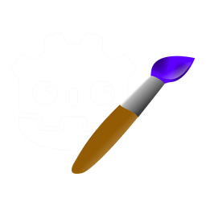
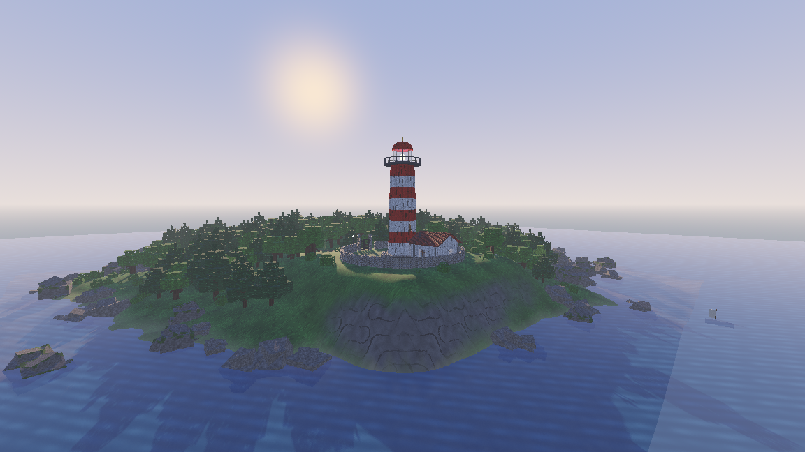
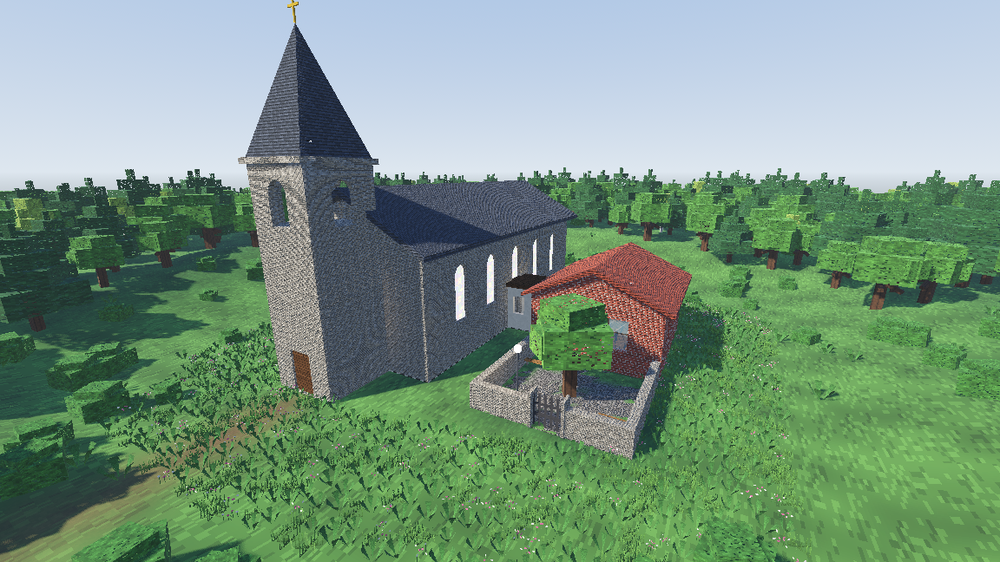
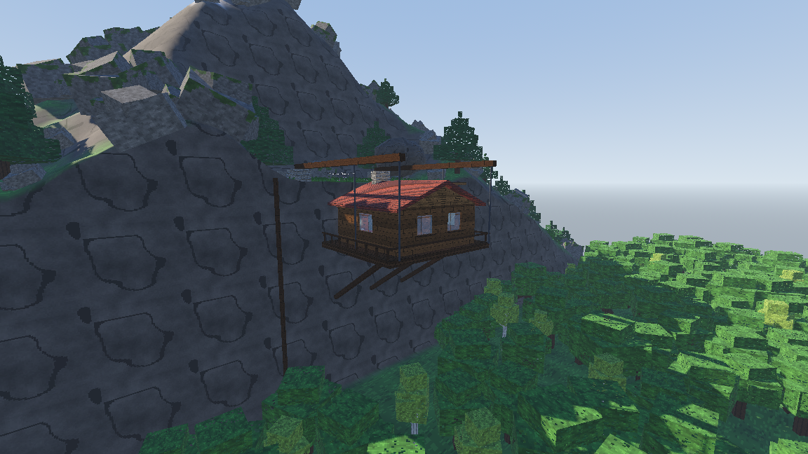
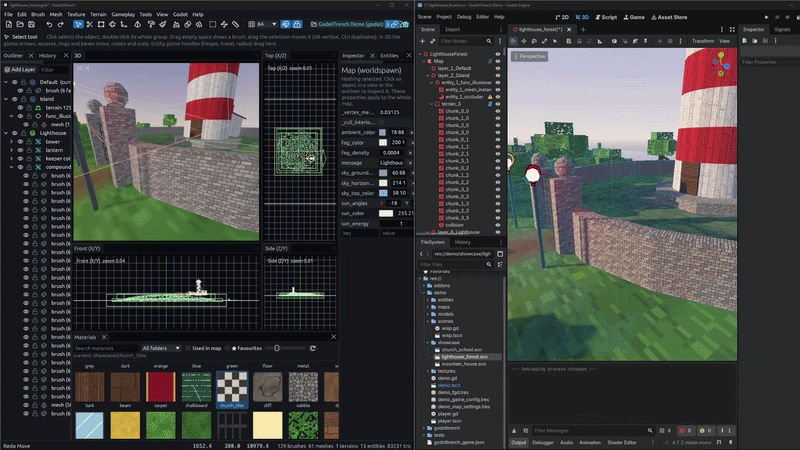

  

# GodotTrench

A brush based level editor for Godot, written in Rust. heavily inspired by TrenchBroom and Hammer++, it aims for TrenchBroom parity plus
Hammer++ features (entity I/O, prefabs, displacements, decals, vertex paint, lit preview) and Godot specific QoL like a live view.

Maps are saved as `.gtm` and loaded in Godot by our fork of [FuncGodot](https://github.com/func-godot/func_godot_plugin).

<table>
  <tr>
    <td></td>
    <td></td>
    <td></td>
  </tr>
  <tr>
    <td align="center">Lighthouse and Forest</td>
    <td align="center">Church and School</td>
    <td align="center">Mountain Hanging House</td>
  </tr>
</table>

the showcase maps above are rendered in Godot and were built entirely through the editor's MCP tools, see [examples/mcp](examples/mcp).

work in live mode to instantly see changes before saving 
[Working with Godot](docs/godot.md).

# Disclosure
This project makes use of AI / LLMs, specifically Claude.
Expect bugs and weird shenanigans, feel free to open issues or pull requests with fixes.

If you want to use AI to create pull requests you must ensure it isn't sloppy (like heavy em dash use, useless and unnecessary comments and a heavy use of emojis)

by creating a pull request you vouch for the changes the AI made, and if it causes any faults you own the blame.

you must pass the whole test suite and preferably write tests for the feature you changed or added.

agents working on the repo should follow [AGENTS.md](AGENTS.md), it lists the checks, style and gotchas.

## Download

grab the [rolling alpha](https://github.com/Paraxdev/GodotTrench/releases/tag/alpha): the editor for Linux, Windows and macOS,
the forked addon (unzip into your Godot project) and a demo project. or build it yourself with `cargo run -p gt_editor --release`.

to use a map in Godot, add a `FuncGodotMap` node, point it at a `.gtm` file and press *Build Map*.

## Features

* brushes, meshes and terrains with TrenchBroom style editing, CSG, clip, vertex and texture tools
* scatter trees, rocks and foliage onto chosen surfaces, blend materials and terrain layers
* doors, lifts, buttons, triggers, spawners and logic entities with Hammer style I/O, plus C# entities
* live link to Godot with a live mode that shows edits before saving, lit preview, prefabs, displacements and decals
* an MCP server so agents and scripts can build maps too

## Docs

* [Tools and controls](docs/tools.md)
* [Working with Godot: live mode, builds, live link protocol](docs/godot.md)
* [Gameplay entities, I/O and C#](docs/gameplay.md)
* [MCP server and scripts](docs/mcp.md)
* [Development: building, tests, CI](docs/development.md)
* [Fork changes](godot/addons/func_godot/FORK.md)

# Thanks

this project couldn't exist with the work of:  
[TrenchBroom](https://github.com/TrenchBroom/TrenchBroom) as it inspired the whole ui and features
and [FuncGodot](https://github.com/func-godot) which was forked and modified to have a more advanced set of features.

the toolbar, menu and outliner icons are from [Lucide](https://lucide.dev).

# License
GodotTrench is AGPLv3 licensed, see [LICENSE](LICENSE). third party code and assets are listed with their licenses in [LICENSES.md](LICENSES.md).

