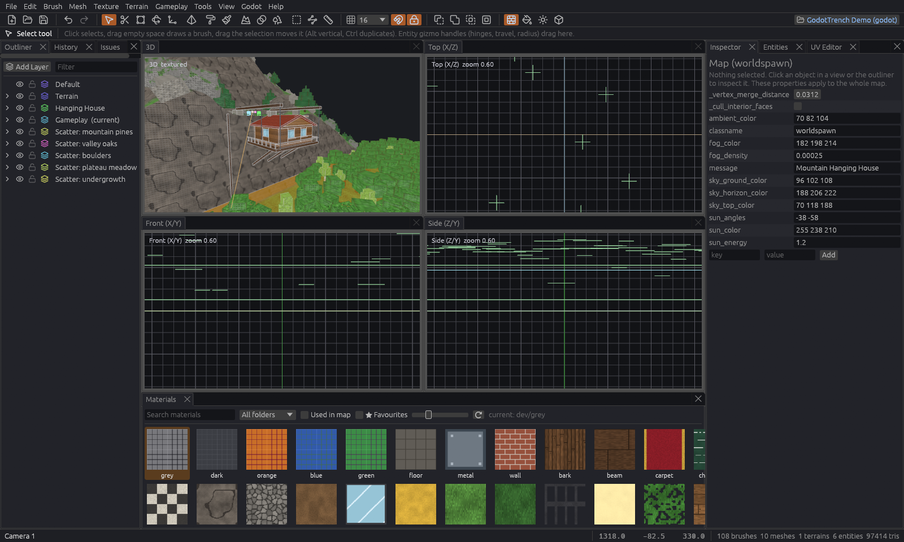

# GodotTrench

GodotTrench is a brush based level editor for Godot in the spirit of TrenchBroom and Hammer. You block out a level from
brushes, add meshes, terrain and props, and wire gameplay together with Hammer style inputs and outputs, so a button can
open a door without a line of script. The editor is a standalone app, and the GodotTrench addon inside your Godot
project turns the saved map into a scene.

## How the pieces fit

Three parts work together, and they talk to each other through files in your Godot project.

| Part | What it does |
| --- | --- |
| The editor | The app you build levels in. It saves each level as a `.gtm` map file |
| The addon | A Godot plugin that reads a `.gtm` file and builds meshes, collision and working entities from it |
| The game config | `godottrench_game.json`, written by the addon. It tells the editor which entities and textures your project has |

When something looks wrong on one side, one of these three is usually out of date. A new entity script, for example,
only shows up in the editor once the addon has written the game config again.

## Where to go

| You want to | Read |
| --- | --- |
| Set up a project and build a first room | [Getting started](getting-started.md) |
| Find your way around the editor | [Interface and navigation](editor/interface.md), [Shortcuts](editor/shortcuts.md) |
| Understand what happens in Godot | [Building maps](godot/building.md) |
| See edits in Godot before saving | [Live mode and hot reload](godot/live.md) |
| Make doors, triggers and scripted scenes | [How entity I/O works](gameplay/io.md), then [Button opens a door](tutorials/button-door.md) |
| Build outdoor terrain | [Terrain](editor/terrain.md), then the [sea island tutorial](tutorials/sea-island.md) |

## Download

The [latest release](https://github.com/Paraxdev/GodotTrench/releases/latest) has the editor for Linux, Windows and
macOS, the addon zip and a demo project. The [rolling beta](https://github.com/Paraxdev/GodotTrench/releases/tag/beta)
has the newest changes from `main`, so it gets fixes sooner but is less tested. To build from source, see
[Development](development.md).



## MCP

The editor can also be driven from scripts or AI agents. The [MCP server](mcp.md) page explains how to connect one and
which tools it offers.


