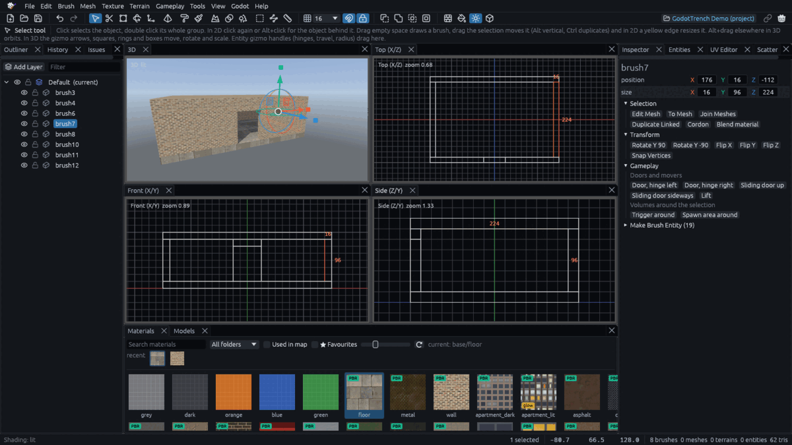

# Interface and navigation

GodotTrench follows TrenchBroom and Hammer, so if you have used either, most habits carry over. If not, this page
covers what you need.

## The window

A menu command sits under the kind of object it changes, and the command palette (Ctrl+Shift+P or F1) finds any
command by name. Hovering a command with a jargon name, like *Hollow* or *UV Lock*, explains what it does, and the
palette shows the same line under its list. Esc or a click outside closes the palette without running anything.
The **tool options bar** under the toolbar holds the settings of the active tool.

An empty map shows a card in the 3D view with its first steps, a link to this guide and the maps of the open project,
and the 2D views say where to drag. **Hide tips** turns them off, and *File > Preferences* brings them back.

| Panel | Dock | What it is for |
| --- | --- | --- |
| Outliner | Left | The map as a tree of [layers, groups](organizing.md) and objects |
| History | Left | Every edit, click one to undo back to it |
| Issues | Left | Problems found as you work, like faces with no material |
| Inspector | Right | The selection's properties, such as an entity's keys or a brush's exact position and size |
| Entities | Right | Entity classes to drag into a view |
| UV Editor | Right | [Exact texture placement](uv-editor.md) |
| Scatter | Right | The models the [Scatter](scatter.md) tool paints |
| Materials | Bottom | Your project's textures |
| Models | Bottom | [Model files](models.md) to place |
| Logic | Starts closed | Fires an output on paper and shows what it would trigger |
| Reference | Starts closed | Code for using an entity class from your scripts |

Open any panel from *View > Panels*, and *Reset Layout* in the same menu restores the defaults.

## Views

The views are 3D, Top, Front and Side. The 2D views look straight along one axis, which makes lining things up easier.
With something selected, they print its width above it and its height beside it. A click in a 2D view selects the
nearest object along the view, so a ceiling hides the walls under it in the Top view. Click again at the same spot
within a second or so, or Alt+click at any time, to step to the next object under the cursor.

| Do this | To |
| --- | --- |
| Drag the point where the dividers cross | Resize all four views at once |
| Shift+Space | Maximize the view under the pointer, again to restore |
| *View > Views* | Switch between one, two and four views, or bring back a closed view. Single View keeps the view you last worked in, the 3D view to begin with, and while one view is shown picking another view's name switches to it |

## Tabs

Each open map gets a tab, and the tab bar appears once two are open. Ctrl+Shift+N opens a new tab, Ctrl+Tab switches
and Ctrl+W closes one. *New Map* and importing open in a new tab when the current map has unsaved changes. Closing a
modified tab asks to save, discard or cancel, and quitting lists every unsaved map.

## Camera

| Input | 3D view | 2D views |
| --- | --- | --- |
| Right drag | Look around. WASD moves, Q and E go down and up, Shift triples the speed | Pan |
| Middle drag | Pan | Pan |
| Wheel | Move forward and back, faster the farther away the surface straight ahead is | Zoom towards the cursor |
| Alt+left drag | Orbit, unless the drag starts on the selection, which then moves vertically | |

WASD only flies while the right button is held, otherwise those keys are shortcuts. Hovering a view's tab shows its
controls. **F** frames the selection in
every view, or the whole map when nothing is selected.

Ctrl+Shift+1 to 9 stores the 3D camera as a bookmark and Ctrl+1 to 9 jumps back. Bookmarks are saved in the map,
and undo does not touch them.

## Shading

F4 cycles the 3D view through Textured, Flat, Lit Preview and Wireframe. F3 jumps straight to **Lit Preview** and back
to Textured, without cycling through the others. Lit Preview shows the map's lights, sun shadows, sky and fog without
building in Godot. It draws only the 64 strongest point and spot lights, so a map with many more can look darker here
than in Godot.

## Interface scale

Ctrl+= and Ctrl+- scale the interface and Ctrl+0 resets it. If the monitor reports the wrong display scaling, untick
*follow the monitor* in *File > Preferences*.
