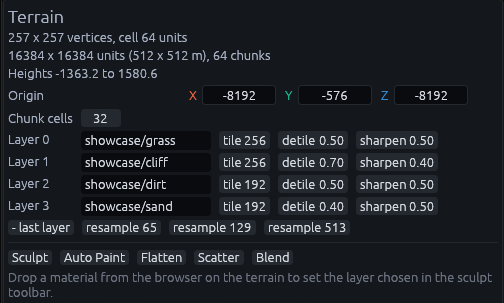
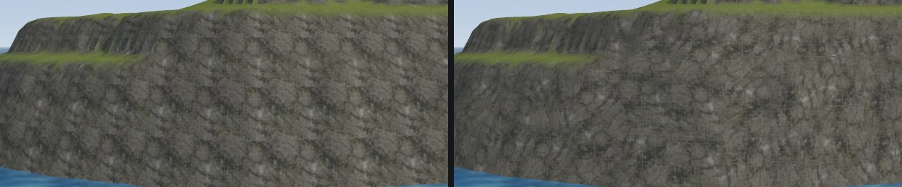
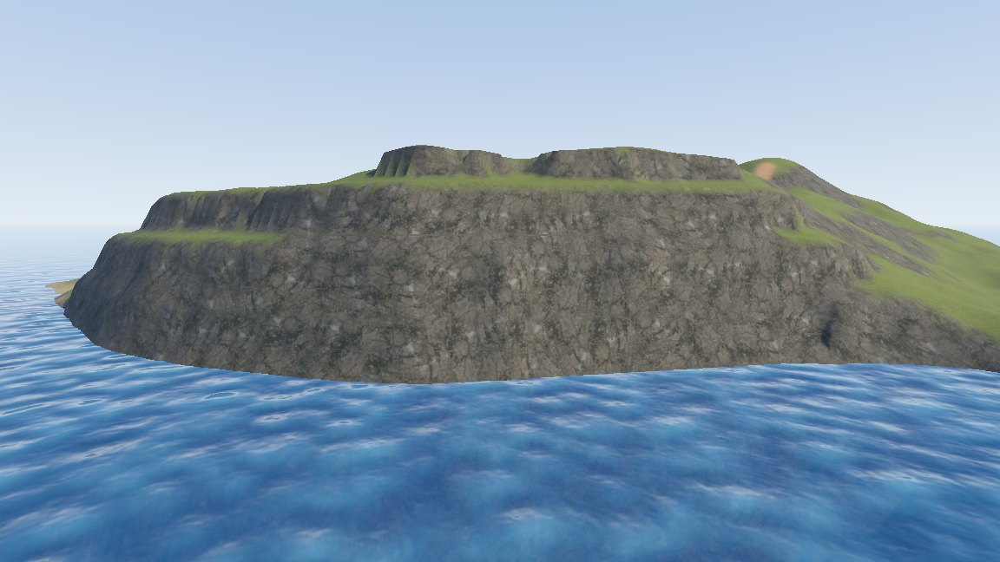

# Terrain layers

A terrain has one to four layers, edited in the Inspector with the terrain selected. Each layer is a material, a
**tile** size and two de-tiling settings. The layers share the ground between them, so painting sand onto grass takes
weight away from grass.

| To | Do this |
| --- | --- |
| Add a layer | *+ layer (current material)* |
| Remove the last layer | *- last layer* |
| Change a layer's material | Type its name, or drop a material on the terrain. With the Blend tool active it fills the layer the tool paints |

**Layer 0 is the base ground.** Unpainted ground shows layer 0 and erasing paints back to it, so put your most common
ground there, usually grass.

A new terrain gets the layers named in the *Create Terrain* dialog, four by default. Dropping a material for a layer the
terrain lacks adds it as the next layer.

## Tile and de-tiling

| Setting | Meaning |
| --- | --- |
| tile | Map units one repeat covers. 128 to 384 works well for walkable ground |
| detile | 0 to 1. Turns and shifts every repeat randomly so the grid stops showing |
| sharpen | 0 to 1, shown once detile is above 0. 0 mixes the repeats evenly and looks soft, 1 mixes only where they join |

A small tile is sharp up close but repeats visibly from afar, a large one blurs at your feet. Detile hides the repeat
without a bigger tile, but it costs extra texture reads, so leave it at 0 where the repeat does not show.

> **Note:** The material's `metadata/texture_size` does not apply to terrain, only **tile** does.

## How it looks in Godot

Each layer is projected from above and from the sides, so cliffs show rock instead of a smear, and it matches the
editor. Each layer uses its material's colour texture, normal map, roughness and emission. Ambient occlusion is used
when it sits in the roughness texture, like in an ORM texture, or when the layer has no roughness texture.

