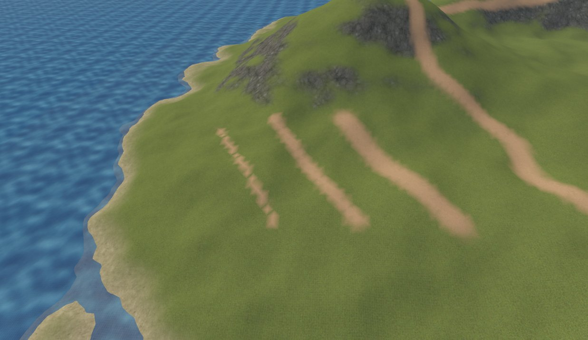
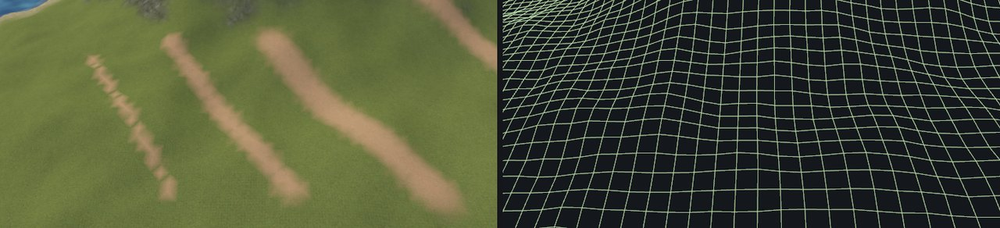

# Terrain painting

Paint is stored as four weights per terrain vertex, one per layer, and they always add up to one. Painting sand onto
grass takes weight away from grass.

## Layers

A terrain has one to four layers, edited in the Inspector with the terrain selected. Each layer is a material, a
**tile** size and two de-tiling settings.

| To | Do this |
| --- | --- |
| Add a layer | *+ layer (current material)*, or drag a material onto the terrain |
| Remove the last layer | *- last layer* |

**Layer 0 is the base ground.** A new terrain is all layer 0, erasing paints back to it. Put your most common ground
there, usually grass.

Paint only goes into layers the terrain has. Asking for layer 3 on a two layer terrain paints layer 1, and the status
bar says so. Add the layer first.

## Tile and de-tiling

| Setting | Meaning |
| --- | --- |
| tile | Map units covered by one repeat. 128 to 384 works well for walkable ground |
| detile | 0 to 1. Turns and shifts every repeat randomly so the grid stops showing |
| sharpen | 0 to 1. How much of each repeat stays untouched. 0 hides seams best but softens the texture |

A small tile is sharp up close and repeats visibly from afar, a large one hides the repeat but blurs at your feet.
Detile fixes the repeat without making the tile bigger. It costs four texture reads per projection, so leave it at 0
where the repeat does not show.

The tile has nothing to do with the texture's pixel size or its material's `texture_size`, those only apply to brush
and mesh faces.

## The Blend tool

Press **Shift+G**. Pick a mode, a falloff, the **layer** (0 to 3), the radius and a strength from 0 to 1. Several light
passes give softer edges than one strong pass.

| Mode | Paints |
| --- | --- |
| paint | Towards the layer |
| erase | Back towards layer 0 |
| smooth | Softens borders |
| sharpen | Lets the strongest layer win |
| noise | Only in cloud shaped patches, for moss, dry grass, gravel |
| slope | Only where the ground is between two angles. `30` to `90` puts rock on anything steeper than 30° |
| height | Only between two world heights, for sand at a waterline or snow above a tree line |

The slope and height masks make huge brushes safe. Sweep a hill sized brush in slope mode and only the cliffs turn to
rock. Mask edges fade over a few degrees or up to 64 units, so they blend instead of cutting.

| Falloff | Shape |
| --- | --- |
| smooth | Gentle fade |
| linear | Even fade |
| constant | Whole disc at the same strength |
| spray | Random speckles, for pebbles and flowers |

Shift turns paint, noise, slope and height into erase. Ctrl smooths.

## Auto Paint

*Terrain > Blend > Auto Paint Layers* paints the whole terrain from its shape:

| Layer | Goes on |
| --- | --- |
| 1 | Slopes steeper than about 50° |
| 2 | The top 20% of the height range |
| 3 | The bottom 8% of the height range |

The range runs from the lowest point, which on an island is the sea floor. Use **Bands from sea level** to measure from
a height you give instead. Auto Paint replaces all paint, so run it before painting by hand, never after.

## How narrow you can paint

Paint lives on the vertices, so the brush radius only matters relative to the cell size.

| Radius | Result |
| --- | --- |
| Below one cell | A staircase |
| About 1.5 cells | Continuous, ragged edges |
| 2 cells or more | A clean band |

For a narrow track, use smaller cells or lay a mesh or decal on top. Terrain paint is for ground cover you read from
far away.

## How it looks in Godot

Each layer is projected from above and the two sides and blended by the surface angle (triplanar mapping), so cliffs
show rock instead of a smear. The projection is anchored to the world and matches the editor exactly.

Only each material's colour texture and emission are used, normal and roughness maps are not. Pick photo scans with
some light and shadow baked in.

## Habits that work

1. Sculpt first, paint afterwards. Paint does not move with the ground.
2. Start with the biggest sensible brush and a low strength.
3. Rock with Auto Paint or a slope brush, shoreline with a height brush, paths by hand.
4. Soften borders with a light smooth pass, then break them up with noise or spray.
5. Decide your four layers early. Keep one free for ground that follows no rule, such as paths.
