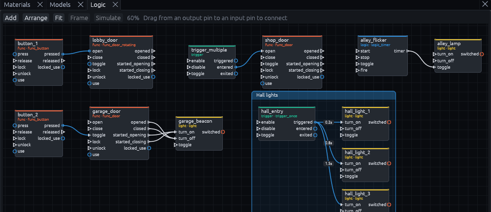
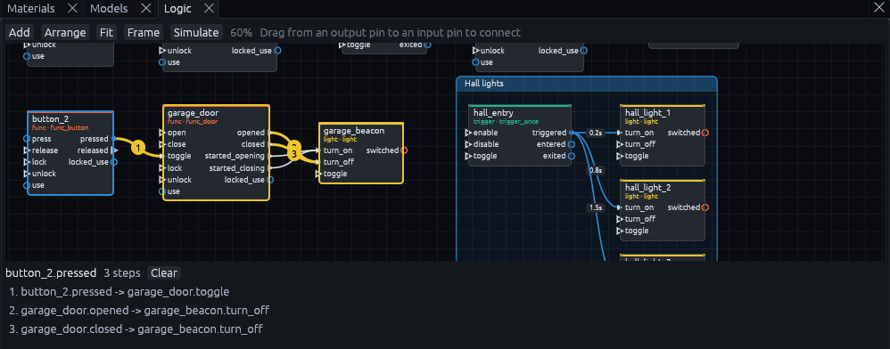

# The Logic graph

The **Logic** panel shows the map's entity I/O as a graph. Every wired entity and every logic entity is a node, and
every output connection is a wire from an output pin on the right of one node to an input pin on the left of another.
The graph is a view of the same outputs the Inspector edits, so a change in either shows in the other at once, and the
map, the Godot build and the game work exactly as they did without it.

Open it from *View > Panels > Logic*. It opens next to Materials below the views and makes that dock about half as
tall as the middle of the window, since a graph needs room. Drag the divider or the tab to change that.

## Reading the graph

| What you see | What it means |
| --- | --- |
| Node title | The entity's targetname, else its name from *Rename*, else its classname. Below it are the category and the classname |
| Gray lines under the title | The settings that differ from the entity's defaults, like `max 3`, `wait 2 s` or `once`, cut to two short lines. A node without them is at its defaults. The Inspector shows all of them |
| Header color | The category: the definition's group, else the classname's first word, so `logic_relay` is *logic*. See [Colors](#colors) |
| Pins | Inputs on the left, outputs on the right, from the [entity definition](entities/README.md) plus any name the map already uses on that entity. A filled pin has a wire. Hover a pin for its type and the values it passes |
| Yellow pin name | The name is not in the entity's definition, the Issues panel warns about it too |
| Wire label | The delay, `once` or how many times it may fire, and the parameter, when they are set |
| Blue node and wire | A [target](parameters.md#targets) only the running game resolves, such as `!player`, `@enemies`, a node path or a wildcard like `door_*` |
| Red node, dashed red wire | A targetname no entity has, usually a typo |

Only wired entities and logic entities have a node. Select any other entity, in a view or the Outliner, and it shows
up too, ready to be wired.

## Colors

Colors help you scan a big graph, but every color also comes with a name or a shape, and the palettes stay apart for
the common kinds of color blindness.

| Category | Color |
| --- | --- |
| logic | blue |
| math | orange |
| trigger | bluish green |
| func, doors, buttons and movers | vermillion |
| light | yellow |
| env | teal |
| game | sky blue |
| prop | pink |
| npc | reddish purple |
| info | gray |

| Pin type | Color |
| --- | --- |
| pulse, an event without a value | white |
| bool | vermillion |
| int | sky blue |
| float | bluish green |
| string | pink |
| vector3 | yellow |
| color | reddish purple |
| node, such as the activator | blue |
| variant, any value | gray |

Pins that pass a value are circles, pulses are triangles. A wire takes the color of the output it starts at. A
category of your own, set with the `group` of a definition, gets a color of its own too.

## Wiring

1. Drag from an output pin to an input pin. The connection is added to the source entity's outputs. A target without
   a targetname gets a free one, like `door_2`, in the same step.
2. Drop the wire on a node's title instead, to pick from all its inputs or type any name.
3. Drop it on empty space to add a logic entity there, already wired to the pin you dragged from.

Right click empty space, or use **Add**, to add a logic entity without a wire. The list is grouped by category, logic
and math first, then other entities that have inputs or outputs, and the search field looks through all of them. New entities are
point entities, and the Godot build makes a node for each, so they need a place in the map. They go on a layer called
*Logic*, next to the entity they are wired to, or in front of the 3D view's camera.

Click a wire to edit its output, target, input, parameter, delay and times in the box at the top right. Its **Delete**
button, or the Delete key while the pointer is over the graph, removes it. Every change is one step in *History*, so
undo works as everywhere else.

> **Note:** Without the Gameplay entities pack there are no logic entities to add. The Add menu then offers to
> install it.

## Moving around

| To | Do |
| --- | --- |
| Zoom | Turn the wheel |
| Pan | Drag with the middle or right button |
| Select | Click a node, Shift or Ctrl click adds, drag on empty space to box select. The entities are selected in the views and the Outliner too, and the other way round |
| Frame in the views | Double click a node |
| Move | Drag nodes. Their positions are saved in the map |
| Tidy up | **Arrange** lays out the selected nodes by signal flow. With fewer than two selected, every node goes back to the automatic layout |
| See everything | **Fit** |

Nodes nobody moved follow the automatic layout, left to right the way signals flow, and the view zooms to fit the
panel until you zoom or pan yourself. Once you move a node or wire something in the graph, the others keep their
places, and a new node appears next to what it is wired to. Blue and red marker nodes are not entities, so they
cannot be moved. They sit next to the node that targets them.

## Frames

A frame is a titled box behind a group of nodes, to keep a big graph organized: the doors of one building, a puzzle, a
cutscene. Select the nodes and press **C** over the graph, or **Frame** in the toolbar, then type its title.

| To | Do |
| --- | --- |
| Move a frame with everything inside | Drag its title |
| Resize it | Drag the corner at its bottom right |
| Rename it | Double click its title, or select it and press F2 |
| Recolor or delete it | Right click its title. Deleting a frame keeps its nodes |

Frames are saved in the map as editor data, the Godot build ignores them.

## Simulate

Select one entity, press **Simulate** and pick one of its outputs, or right click a node. The graph numbers every wire
the output would set off in yellow, and a list below the graph shows each step by the node titles, in the order the
steps arrive, with the time in seconds after the delays. **Clear** ends the preview. It follows the runtime's rules:
targets are found by targetname, and relays, timers, counters, gates, doors and the other common entities pass the
chain on. Runtime targets like `!player` are shown but not followed. Click a step to select its wire.

An entity that fires one of several outputs shows every wire it might set off. Those steps, and everything after them,
end in `(maybe)` in the list and in `?` on the wire's number, and hovering one says what it waits for. A counter fed
by `add` or `subtract` continues to `hit_max` and `hit_min` this way, since the preview does not count presses: the
step is there, and it happens once the counter reaches its `max` or `min`. A `logic_sequence` fires its steps at the
times of its `interval`, `times` and `steps` properties, so a cutscene reads as a timeline.

Simulate works on paper, without Godot. What really happens in game is covered in [Debugging wiring](debugging.md).
