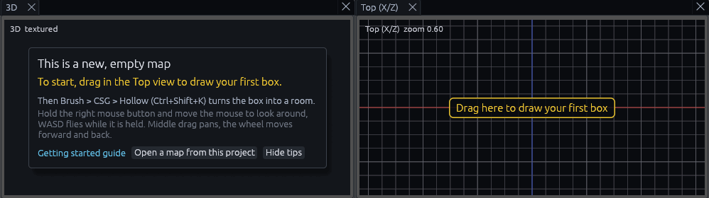
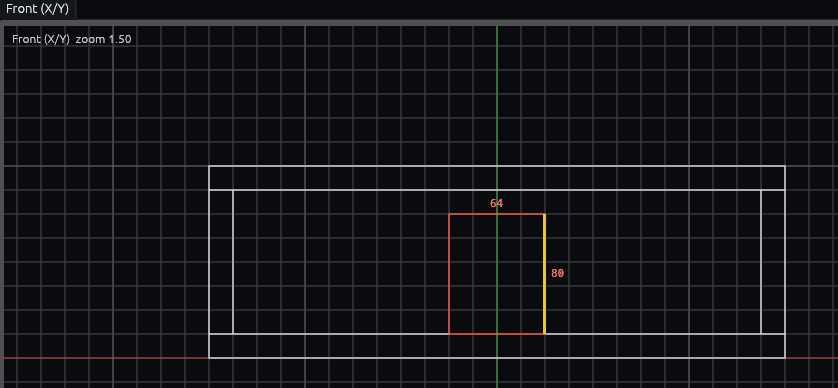
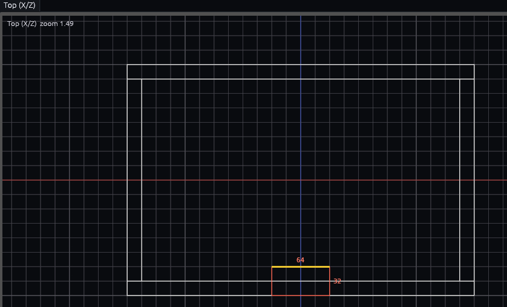

# Getting started

Steps 1 to 3 connect a Godot project to the editor and are done once per project. Steps 4 and 5 build a first room and
load it in Godot.

## What you need

Godot 4.7, CI tests the addon on 4.7.2. Use the .NET build if you want to write entities in C#. The editor is in the
[rolling beta](https://github.com/Paraxdev/GodotTrench/releases/tag/beta), and it installs the addon for you.

## 1. Open the project in the editor

Choose *Godot > Open Godot Project…*, or the **Open Godot project…** button in the toolbar, and pick the project
folder or any folder inside it. The editor reopens it on the next start.

## 2. Install the addon

The addon is the Godot plugin that turns maps into scenes. The first time a project opens, the *Set up this project*
window offers it: press **Install the addon**, then **Enable the plugin**. The editor downloads the addon from the
GodotTrench release into `addons/func_godot` and adds it to the enabled plugins in `project.godot`, leaving the rest of
the file as it was. Close Godot first if it has the project open, or it writes its own copy of that file back.
*Godot > Install or Update Addon…* brings the window back, and
[Project setup](godot/project-setup.md#installing-and-updating-the-addon) explains updates.

> **Tip:** To install by hand, extract `func_godot-godottrench-addon.zip` from the
> [releases](https://github.com/Paraxdev/GodotTrench/releases) or [itch.io](https://paraxdev.itch.io/godottrench) into
> the project folder so it ends up in `addons/func_godot`, then enable **GodotTrench** in Godot under *Project > Project
> Settings > Plugins*.

## 3. Open the project in Godot once

The addon then writes `godottrench_game.json` to the project root, which is how the editor learns your entities and
textures, and the editor loads it within a second. From then on the addon exports again whenever files change. Until
then the status bar says there is no `godottrench_game.json` and the editor uses its built in entities. Doors,
triggers, lights and the other built in entities work out of the box, [Project setup](godot/project-setup.md) covers
replacing them with your own.

### Ready made content

Below the addon, the same window asks whether the project should get ready made content. Nothing is written until you
pick something, and *Godot > Add Content to Project…* brings the question back later.

| Choice | What it adds |
| --- | --- |
| Nothing extra | Nothing. The built in entities and materials work without any files |
| Nature models, about 23 MB | Trees, bushes, rocks, grass and flowers with their textures in `res://godottrench/nature`, for [Scatter](editor/scatter.md) and the [Models](editor/models.md) panel |
| Nature models and the demo, about 130 MB | Also the showcase maps, demo models and textures, overlays and demo scenes in `res://demo` and `res://models` |

The downloads come from the same release as the addon. They keep the files the project already has, and never touch
`project.godot`, the addon or your own files.

## 4. Build a room

The editor opens with four views: a 3D view you fly around in, and Top, Front and Side views that look straight along
one axis. The world is Y-up like Godot, and map units are 32 per meter. Levels are built from brushes, solid convex
blocks such as boxes and wedges. While the map is empty, a card in the 3D view names the first step below and the Top
view marks where to drag.

1. **Draw a box.** With the Select tool (Q), drag on empty space in the Top view, about 384 units wide and 256 deep.
   The Top view prints the size as you drag, and the box snaps to the grid, 16 units (half a meter) by default. The
   first box you draw is 128 units (4 m) tall.
2. **Hollow it.** Press Ctrl+Shift+K. The solid box turns into walls, floor and ceiling 16 units thick, with 96 units
   (3 m) of headroom inside, plenty for a player.
3. **Cut a doorway.** Click empty space outside the room so nothing is selected, since dragging a selection moves
   it. In the Front view, drag a box 64 units wide from the top of the floor up 80 units. A new box takes its depth
   from the last box you drew, so this one reaches through the whole room, from the back wall to the front wall.

   

   The Top view looks down on the room with the front wall at the bottom. The new box is still selected, so drag its
   top edge, which turns yellow under the pointer, down until the box only crosses the front wall.

   

   Then press Ctrl+K, *Brush > CSG > Subtract*, which cuts the selected box out of every brush it overlaps and
   deletes it, leaving a hole in the wall.
4. **Texture it.** Click a texture in the Materials panel. To texture one wall only, Shift+click that face first.
5. **Save.** Press Ctrl+S and save inside the Godot project, since the addon loads maps by their `res://` path. The
   save dialog starts in the project folder.

> **Tip:** With the Select tool, clicking a brush selects it and Ctrl+click adds more. If a click picks the wrong
> brush, click it in the Outliner instead.

## 5. See it in Godot

In Godot, a level is a scene: a tree of nodes, saved as a `.tscn` file, where each node is one thing such as a mesh, a
light or a camera. Godot writes paths inside the project with `res://`, so `res://maps/room.gtm` is the file
`maps/room.gtm` in your project folder. The map is turned into nodes by one node from the addon, `FuncGodotMap`.

1. In the Godot editor, choose *Scene > New Scene* and click **3D Scene** in the Scene panel on the left.
2. Press Ctrl+A (*Add Child Node*), search for `FuncGodotMap` and add it.
3. With the new node selected, set *Local Map File* to your `.gtm` in Godot's own Inspector, the panel on the right of
   the Godot editor. It works like the Inspector in GodotTrench but belongs to Godot.
4. Press **Build Map** at the top of that Inspector, then save the scene with Ctrl+S.

Brushes become meshes with collision and entities become nodes with their scripts, saved with the scene.
[Building maps](godot/building.md) explains the node's other settings.

Leave that scene open in Godot and every save in GodotTrench rebuilds it, straight away while its tab is the current
one, or when you switch back to it. Save the scene in Godot to keep the result. If a save does not rebuild, the status
bar says why, see [Rebuild on save](godot/live.md#rebuild-on-save).

> **Warning:** A build deletes the children of the `FuncGodotMap` first. Put your own nodes next to the map node, or in
> an [overlay](godot/overlays.md).

## Try the demo project

The repository's `godot` folder, also in the release as `godottrench-demo-project.zip`, is a project with the addon
installed. Its main scene plays the showcase maps, which are saved in `godot/demo/maps/showcase`. Open the project in
the editor and pick one under *File > Maps in Project* to see how a finished map is put together.

The demo choice of *Godot > Add Content to Project…* puts the same maps and scenes into your own project. In Godot,
open `res://demo/demo.tscn` and press F6 to play them. Opened in GodotTrench from your project they show without their
textures, because they use the demo's texture folder `res://demo/textures` rather than your project's. The demo project
shows them as they were built.

| Key | Action |
| --- | --- |
| WASD, Space, Shift | Walk, jump, run |
| E | Use doors and buttons |
| 1 to 5 | Switch between the showcase maps |
| F3 | Show the I/O debug overlay, a log of every input and output as it fires, with trigger volumes drawn in |

## Next

To make the room do something, read [How entity I/O works](gameplay/io.md) and build
[Button opens a door](tutorials/button-door.md).



## MCP

The content question does not open by itself in an editor that an MCP client drives: the first tool call other than
`get_state`, `screenshot` and `simulate_input` closes it, and a project opened with `open_project` is not asked about.
`project_content` adds the same content, see [MCP](mcp.md).


