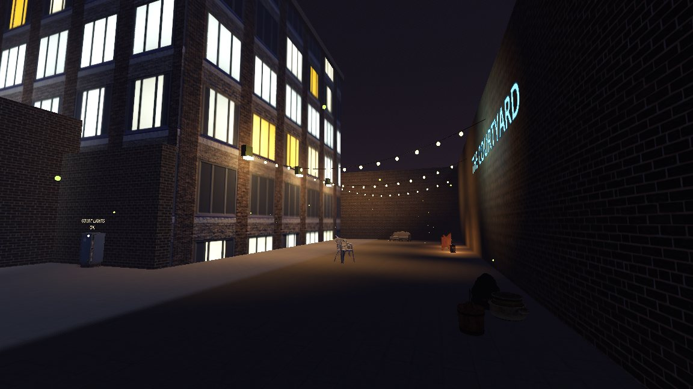

# Overlays

An overlay keeps Godot content on a map through every rebuild: a vending machine with its own script, a particle effect
tuned in Godot, a lamp with an AnimationPlayer.



## Adding one

Add a `GodotTrenchOverlay` node as a direct child of the `FuncGodotMap` and put your nodes under it. Builds, live mode
and hot reload never touch it, so its nodes keep their state and signal connections and are saved with your scene.

For a single node, a direct child of the map in the `godottrench_keep` group survives builds too. An overlay elsewhere
in the scene can point at its map with *Map Path* instead, and then follows the map's transform.

Overlay content uses the map's local space in meters. At 32 units per meter, a child at `(2, 0, -3)` sits where
GodotTrench shows `(64, 0, -96)`.

## What the level designer sees

GodotTrench draws each direct child of an overlay as a dashed blue box with its name, so nobody builds a wall through
the breaker box, and its targetnames count as real targets in the Issues panel and the output editor. *View > Godot
Overlays* hides the boxes, and turning off *Share With Editor* on the overlay leaves it out.

The boxes come from `night_district.overlay.json` next to `night_district.gtm`, written when the map is built in the
Godot editor and when the scene is saved. Commit it with the map.

## Wiring overlays

| You want | Do this |
| --- | --- |
| A map output to reach an overlay node | Give the node a `GodotTrenchOverlayIO` child and set its *Targetname* |
| An overlay node to fire at map entities | Add a `GodotTrenchOutput` child, pick the signal in *Output* and fill in target, input and parameter |
| Content to ride on a moving entity | Put it under a `GodotTrenchAnchor` with *Target* set to the entity's targetname |

An input sent to a `GodotTrenchOverlayIO` calls the node's method of that name, sets its property of that name, or
runs `show`, `hide` or `toggle`, so nodes without a script work too: input `emitting` with parameter `true` starts a
`GPUParticles3D`. Every input also emits `input_received(input, parameter, activator)`.

A `GodotTrenchOutput` listens to any signal of its parent, so an `Area3D` fires on `body_entered` without code. For
your own events, add a signal to the parent's script and pick it:

```gdscript
extends StaticBody3D

signal flipped_on(activator: Node)
signal flipped_off(activator: Node)

var on := false

func use(activator: Node = null) -> void:
	on = not on
	if on:
		flipped_on.emit(activator)
	else:
		flipped_off.emit(activator)
```

An anchor keeps the offset where you placed it and follows the entity through rebuilds, live edits and movement, so a
warning sign goes up with its roller door.

> **Warning:** Wiring survives rebuilds, state does not. Map entities come back in their starting state, so connect to
> the overlay's `map_rebuilt(map)` signal and push your state back, for example switch the lamps on again.

`godot/demo/overlays/night_district_overlay.tscn` has all of this: a breaker box that switches the courtyard lamps,
string lights that a map trigger turns on, and a sign riding the garage roller door.
