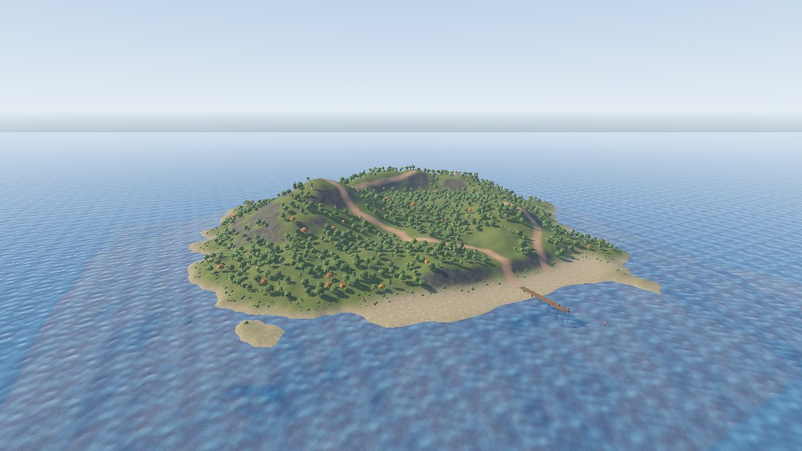

# Sea island 5: pier and Godot

## The pier

Click **Add Layer** in the Outliner, so the pier lands on its own layer and you can hide or lock it apart from the
terrain. Then draw plain brushes running out to sea from the middle of the beach:

| Part | Size | Material |
| --- | --- | --- |
| Deck | 128 wide, 1100 long, 8 thick, top 48 above the water | `showcase/planks` |
| Posts | 16 units square, two rows every 200 units, from 320 below the water up to the deck | `showcase/beam` |
| Railing | Two short posts at the far end, 40 high | `showcase/beam` |

Add props from the demo project's `models/polyhaven` folder with *File > Import > Model Prop (.bbmodel, .glb)...*:
two `wooden_crate_01` and a `wine_barrel_01` on the deck, a `lifebuoy` against a post and an `ocean_buoy` in the
water. A prop references its model by `res://` path, so the file has to be inside the open Godot project.

## See it in Godot

Save the map inside your Godot project and build it with a `FuncGodotMap`, see [Building maps](../godot/building.md).
Each part of the map turns into a different kind of node:

| Map part | What you get in Godot |
| --- | --- |
| Terrain | A `GodotTrenchTerrain` split into chunks, each a mesh that blends the four layers and has its own collision |
| Sea | The `func_illusionary` brush, visible without collision |
| Tree, bush and boulder sets | MultiMeshes, which draw many copies of a model in one go, plus one static body per instance sharing a collision shape |
| Grass sets | MultiMeshes without collision that fade out with distance |

