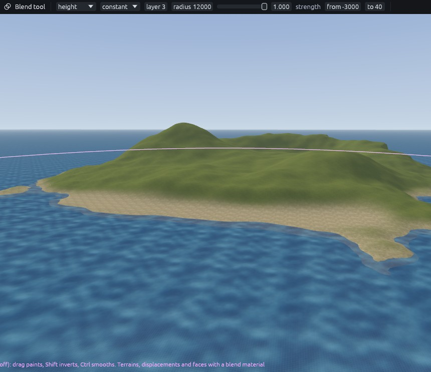
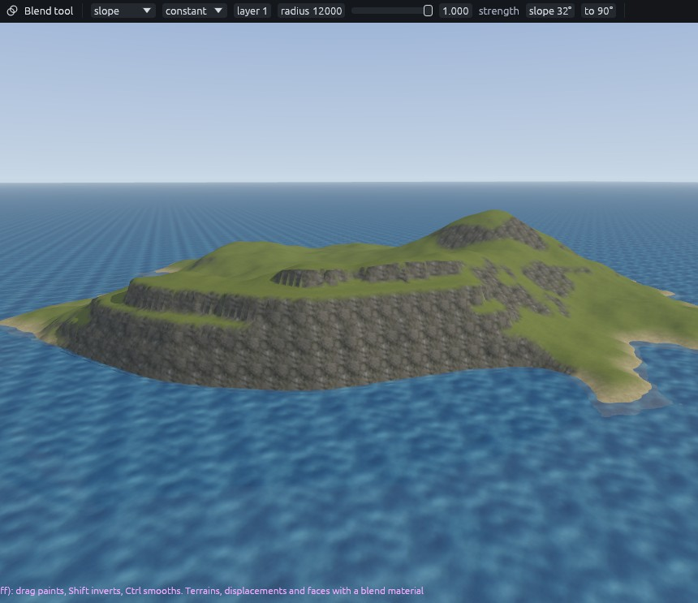
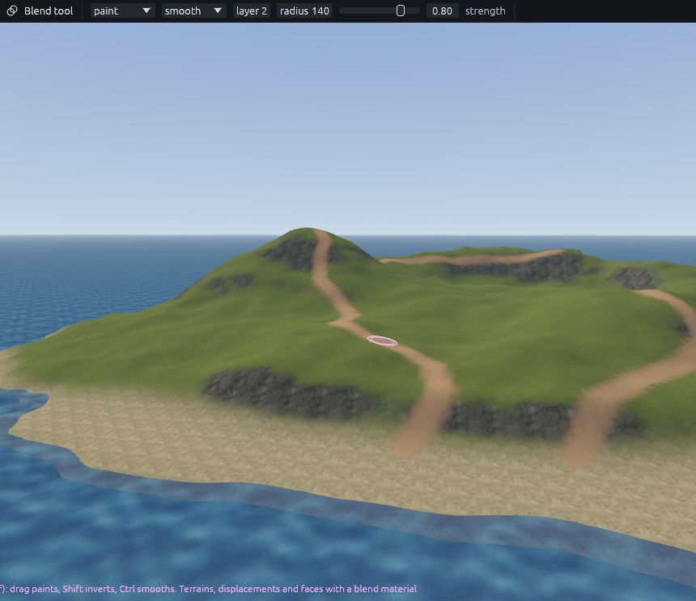
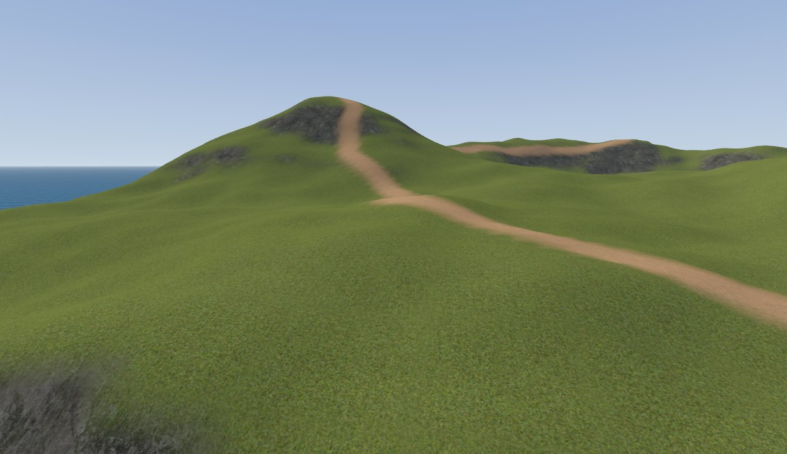

# Sea island 3: painting

Switch to the Blend tool with **Shift+G**, with the terrain or nothing selected. Its settings are in the tool options.
A radius of 12000 covers the whole island, so one click with a height or slope mask paints every shore or cliff at
once.

## Sand and rock

| Setting | Sand | Rock |
| --- | --- | --- |
| Mode | height, from `-3000` to `40` | slope, from `32` to `90` |
| Falloff | constant | constant |
| Layer | 3 | 1 |
| Radius, strength | 12000, 1 | 12000, 1 |

Click once in the middle of the island for each.

The terraced faces turn to rock while their shelves stay green, which is what makes them read as cliffs. To widen the
beach, paint layer 3 along the south shore in **paint** mode, falloff smooth, radius 700, strength 0.7.

## Paths

Mode **paint**, falloff smooth, layer 2, radius 140, strength 0.8. Drag:

1. From the top of the beach up to the main hill in long curves.
2. From the main hilltop along the ridge to the cliff top.
3. From the east end of the beach to the second hill.

## Break up the repeat

Select the terrain and set each layer's **detile** in the Inspector. Detile turns and shifts every tile of the texture
so large areas do not show a grid, and **sharpen** keeps the result crisp.

| Layer | Detile | Sharpen |
| --- | --- | --- |
| 0 grass | 0.5 | 0.5 |
| 1 cliff | 0.7 | 0.4 |
| 2 dirt | 0.5 | 0.5 |
| 3 sand | 0.4 | 0.5 |

Next: [Sea island 4: scatter](sea-island-scatter.md).
