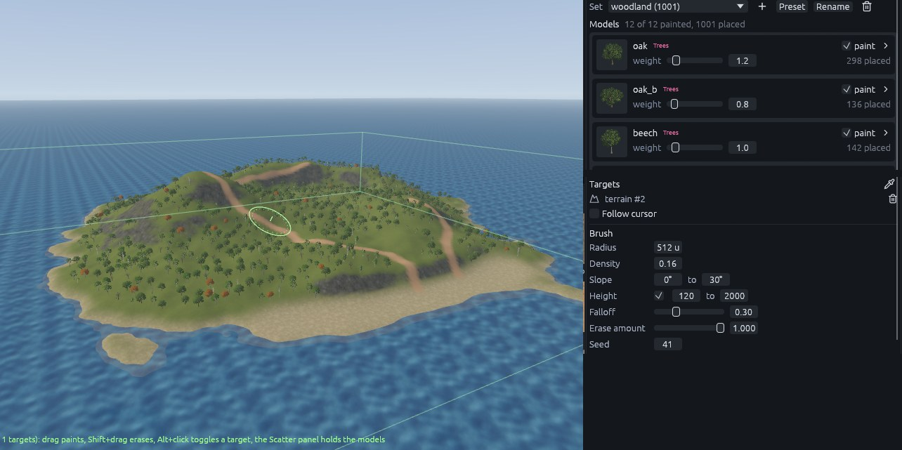
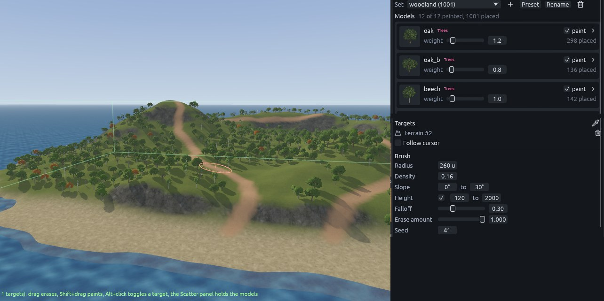
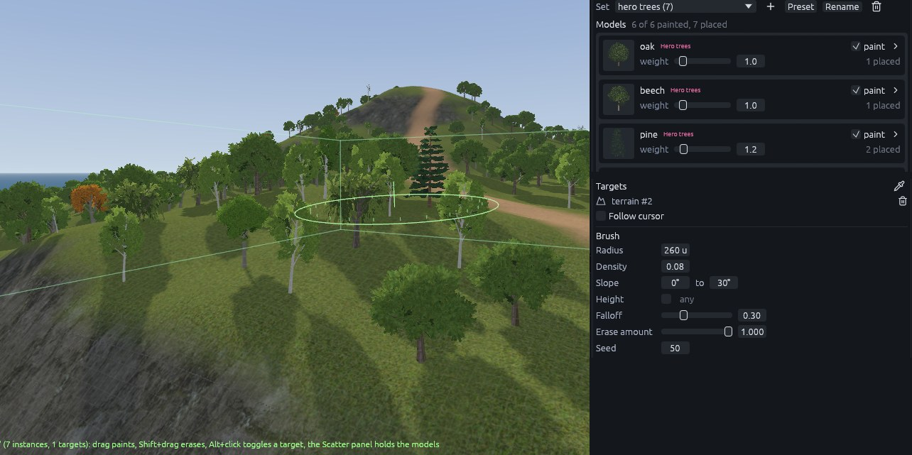
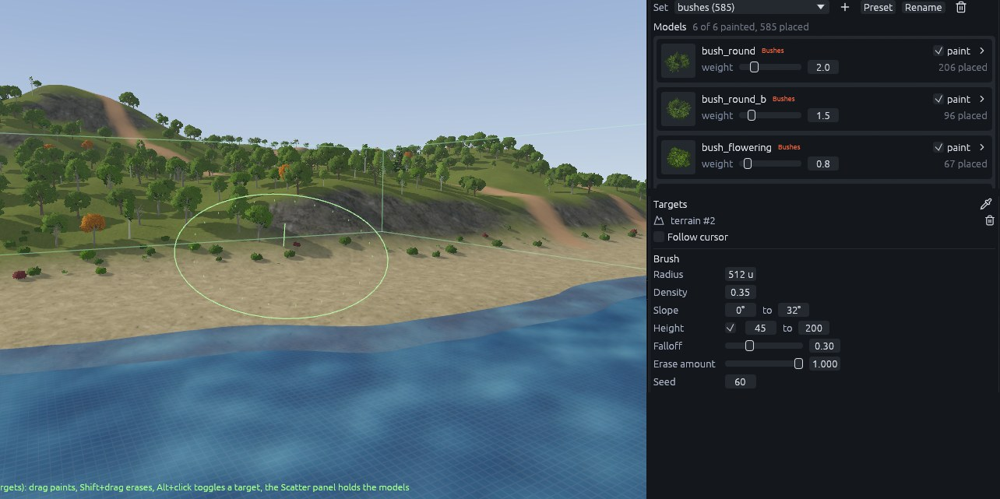
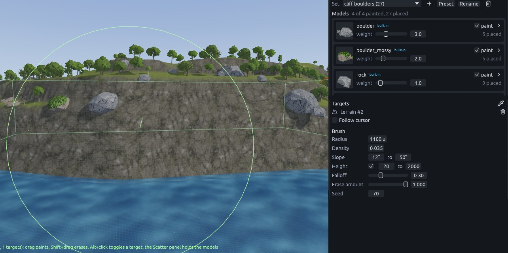
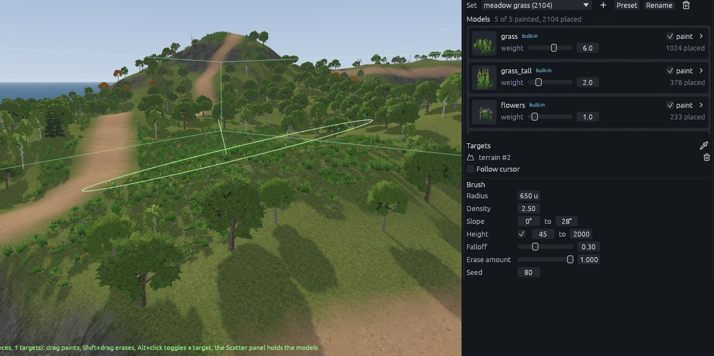
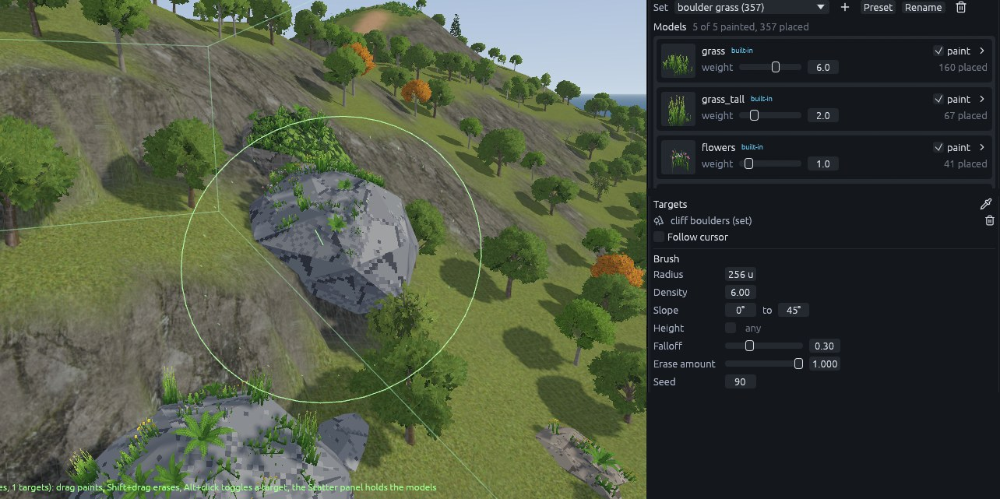

# Sea island 4: scatter

Press **B** for the Scatter tool. Each set below starts from **Preset** in the Scatter panel. Then click the
eyedropper next to **Targets** and click the terrain, so the set only grows on it. Leave **Follow cursor** unticked,
since it ignores the targets, and **Keep spacing to other sets** ticked, so nothing grows through a trunk.

## Woodland

1. **Preset** > *mixed woodland*, **Rename** it `woodland` and target the terrain.
2. In the Brush section set **Density** 0.16, **Slope** 0 to 30 and tick **Height**, 120 to 2000.
3. Click **Fill targets**.

Height keeps trees off the sand and slope keeps them off the cliffs. Density counts attempts per 64 x 64 units, so
0.16 is roughly one tree every 5 m.

Hold **Shift** and drag along each path with radius 260 to erase the trees there. Erase a clearing on the main
hilltop (radius about 520) and a meadow behind the beach (about 700).

## Hero trees, bushes and boulders

| Set | Preset | How | Radius | Density | Slope | Height |
| --- | --- | --- | --- | --- | --- | --- |
| Hero trees | detailed forest | Single clicks where the paths leave the beach and around the hilltop clearing | 260 | 0.08 | 0 to 30 | off |
| Bushes | bushes | **Fill targets**, then erase along the paths with radius 190 | | 0.35 | 0 to 32 | 45 to 200 |
| Boulders | boulders | One stroke along the top of the cliffs | 1100 | 0.035 | 12 to 50 | 20 to 2000 |

## Grass

1. Start a set from the *grass* preset. It is foliage, drawn without collision or shadows.
2. Paint the open meadows with radius 650, density 2.5, slope 0 to 28, height 45 to 2000. Erase it off the paths with
   radius 170.
3. For grass on the boulders, start one more *grass* set. With the eyedropper, click a boulder instead of the
   terrain, so the boulder set becomes its target. **Fill targets** with density 6 and slope 0 to 45.

> **Note:** Fill places grass on the boulders as they are at that moment, so finish the boulders first.

Next: [Sea island 5: pier and Godot](sea-island-finish.md).
