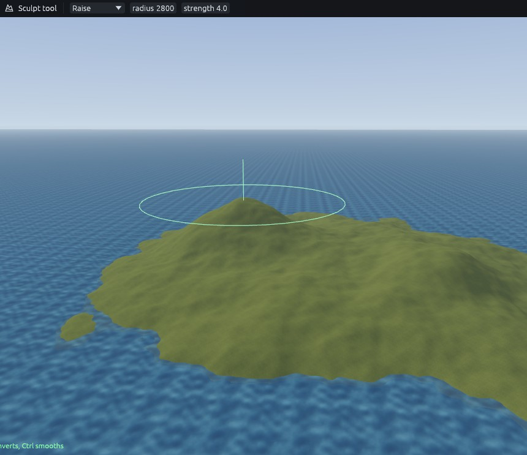
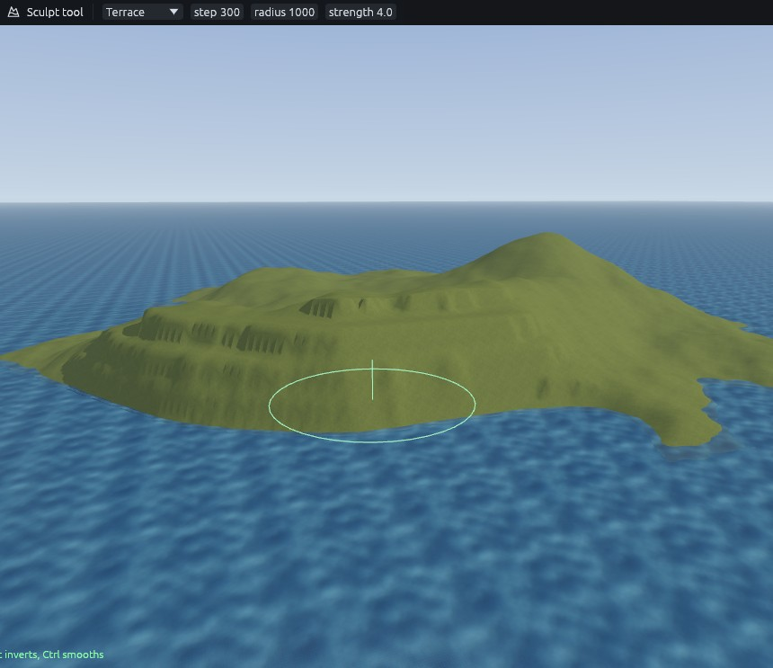
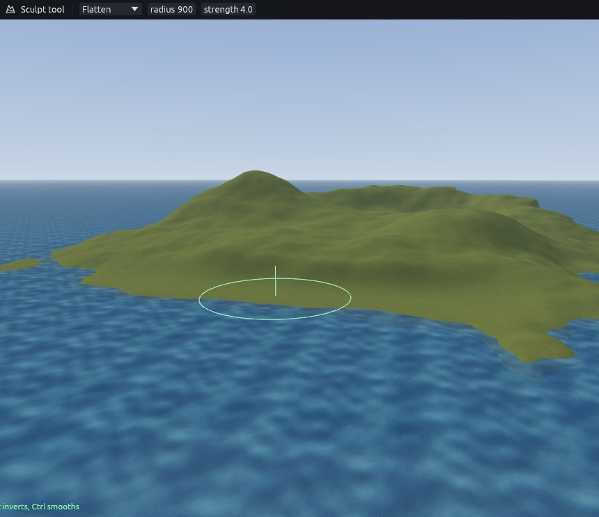

# Sea island 2: sculpting

Sculpting pushes the generated ground into the shapes you want. Select the terrain, or nothing, and press **G** for
the Sculpt tool. It only reaches terrains in the selection, so it does nothing while the sea is selected. Mode, radius
and strength are in the tool options. Hold **Ctrl** while dragging to smooth. The status bar shows the cursor
position, and its middle number is the height, which helps you judge how far you have raised or lowered a spot.

## Hills

1. **Raise**, radius 2800, strength 1. Hold west of the centre for a few seconds, until the hill stands about 1500
   units above the sea.
2. Radius 1300 on the same spot for a steeper top. A smaller brush lifts a narrower area, so the top gets pointier.
3. Radius 1900 for a lower second hill to the south east.

## Cliffs

1. **Raise**, radius 1800. Drag along the north east coast, a little inland, for a headland. Then **Smooth** the whole
   island once with a very large brush to take the lumps out.
2. **Lower**, radius 1000. Drag through the sea in front of that coast to deepen it, so the cliff drops into deep
   water instead of a shallow shelf.
3. **Terrace**, step 300, radius 1000. Terrace snaps heights to steps of the given size. Drag along the coastline so
   it breaks into shelves and steep faces, then go over it once with a light **Smooth**.

## Beach

1. **Flatten**, radius 900. Flatten holds the height the stroke starts at, so start right at the waterline on the
   south shore and drag along the coast.
2. **Smooth** with a slightly larger brush, so the beach runs into the land without a step.

Next: [Sea island 3: painting](sea-island-painting.md).
