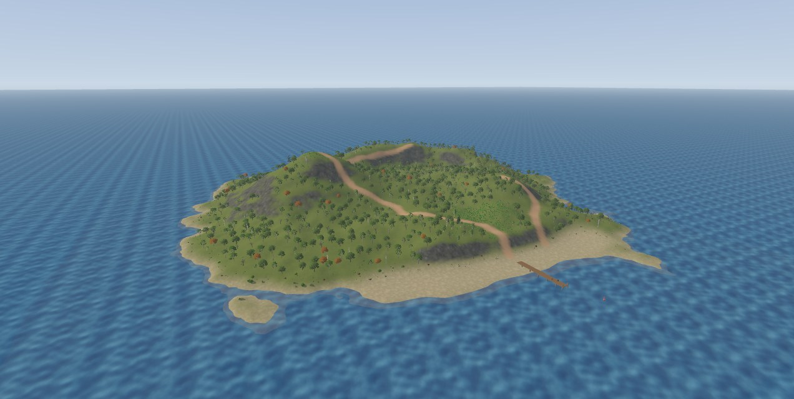
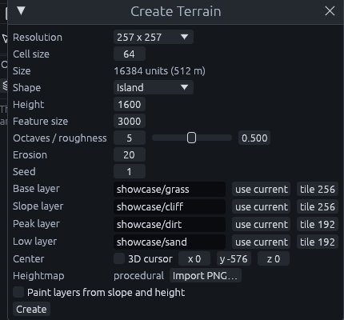
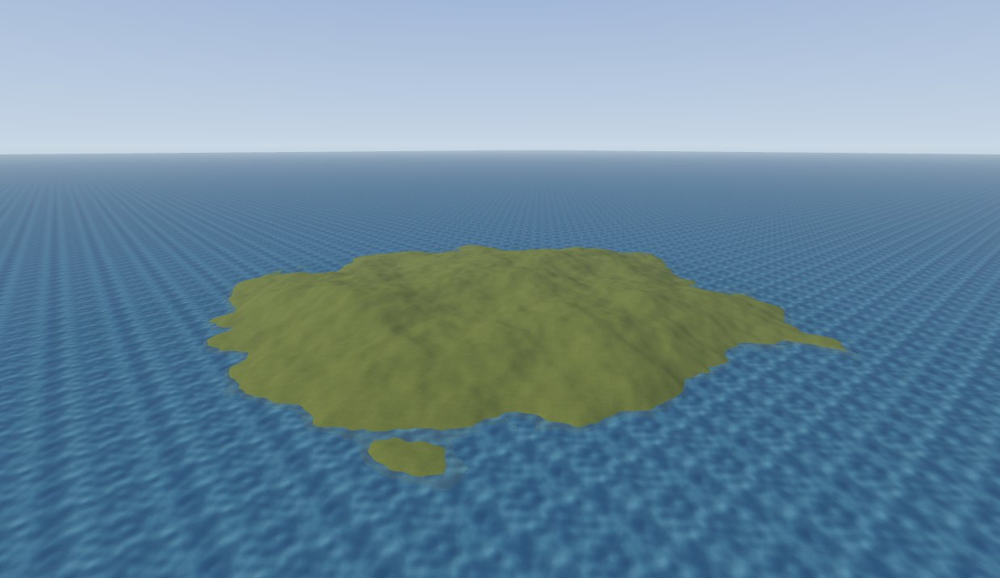
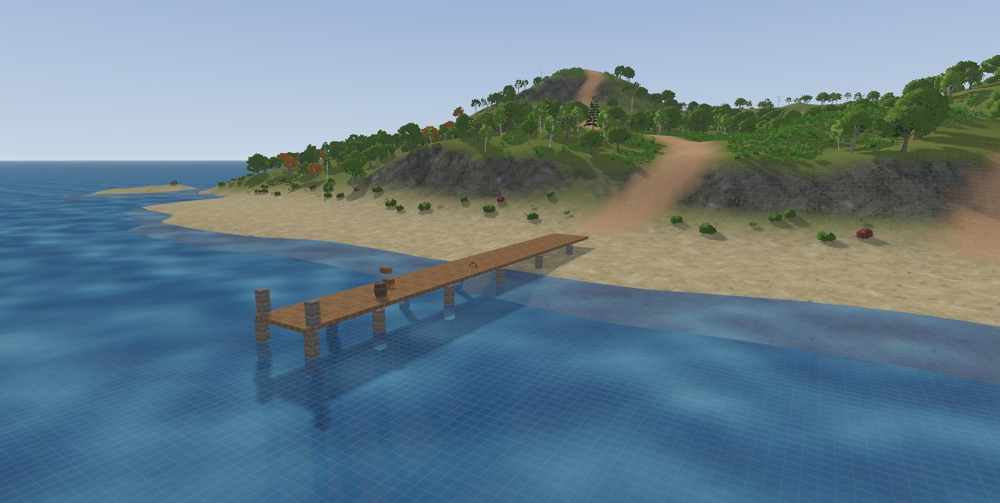
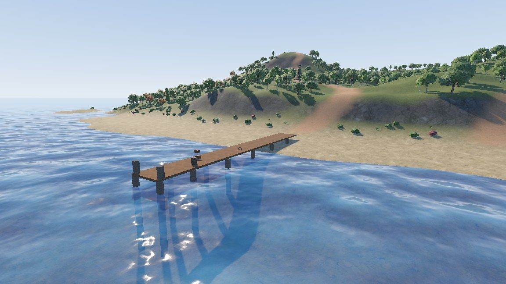

# Building a sea island

A large island in an open sea: two hills, cliffs on the north east coast, a sandy beach, dirt paths, a woodland with
bushes, boulders and meadow grass, and a small jetty. About 380 m across.

The numbers are the ones used for the pictures, at 32 units per meter. Treat them as a starting point, every generator
seed gives a different coastline. [Terrain painting](../editor/terrain-painting.md) explains what the brushes do
underneath.

The whole island is also an MCP script, `examples/mcp/sea_island.json`. Replaying it rebuilds this exact island step by
step, handy for checking a number.

## 1. Choose the four layers

| Layer | Material | Used for |
| --- | --- | --- |
| 0 | `showcase/grass` | Everything that is not something else |
| 1 | `showcase/cliff` | Steep ground and cliff faces |
| 2 | `showcase/dirt` | The paths |
| 3 | `showcase/sand` | The shore and the beach |

Grass goes in layer 0 because it is the base ground. The others follow the order the Create Terrain dialog names its
slots: base, slope, peak, low.

## 2. Create the terrain

Open *Terrain > Create Terrain...* and set:

| Setting | Value |
| --- | --- |
| Resolution | 257 x 257 |
| Cell size | 64 (512 m a side) |
| Shape | Island, Height 1600, Feature size 3000 |
| Layers | The four materials, tile 256 for grass and cliff, 192 for dirt and sand |
| Center | Untick **3D cursor**, set `0 -576 0` |
| Paint layers from slope and height | Unticked |

The sea will be at height 0. Centering the terrain at -576 leaves only its middle dry, with a ring of shallow sea floor
around the coast.

## 3. Add the sea

1. Draw a box in the Top view that reaches far past the terrain on every side. Make it several times the terrain's
   size, or its edge shows on the horizon.
2. In the Front view, make it 32 units thick with its top at height 0.
3. Give it `showcase/water` and set the scale in the Inspector's *Alignment* section to 8 by 8.
4. Right click, *Create Brush Entity > func_illusionary*. It is drawn but has no collision, so the player can wade in.

## 4. Raise the hills

Press **G**, mode **Raise**. Nothing needs to be selected.

1. Radius 2800, strength about 4. Hold over a spot a little west of the centre until the hill stands about 1500 units
   above the sea. The status bar shows the height under the cursor.
2. Radius 1300, a few presses on the same spot for a steeper top.
3. Radius 1900 for a second, lower hill to the south east.

Went too far? Hold **Ctrl** while dragging to smooth it back.

## 5. Build the cliffs

1. **Raise**, radius 1800: drag along the north east coast, a little inland, for a broad headland. Then one **Smooth**
   pass over the whole island with a very large brush.
2. **Lower**, radius 1000: drag along the sea in front of that coast to deepen the water at its foot.
3. **Terrace**, step 300, radius 1000: drag along the coastline. The slope breaks into shelves and steep faces. Finish
   with a light **Smooth**.

## 6. Shape the beach

**Flatten**, radius 900. Start the stroke right at the waterline on the south shore and drag along the coast. Then
**Smooth** with a slightly larger brush so the beach runs into the land without a step.

## 7. Paint the sand

Switch to the Blend tool with **Shift+G**. One click paints every shore:

| Setting | Value |
| --- | --- |
| Mode | height, from `-3000` to `40` |
| Falloff | constant |
| Layer | 3 |
| Strength | 1 |
| Radius | 12000 |

Click once in the middle of the island.

To widen the beach, **paint** with a smooth falloff, radius 700 and strength 0.7 along the south shore.

## 8. Paint the rock

Same huge radius, mode **slope** from `32` to `90`, layer **1**, falloff constant. Click once.

The terraced faces turn to rock while their shelves stay green, which is what makes them read as cliffs. Paint over
unwanted outcrops with layer 0.

## 9. Paint the paths

Mode **paint**, falloff smooth, layer **2**, radius 140, strength 0.8.

1. From the top of the beach up to the main hill in long curves. Zigzag on the steep upper slope.
2. From the main hilltop along the ridge to the cliff top.
3. From the east end of the beach to the second hill.

A radius of 140 on 64 unit cells gives a clean path about 7 m wide. Narrower brushes come out ragged. Soften edges with
**smooth** and a few spray dabs of layer 0.

## 10. Break up the repeat

Select the terrain and set **detile** in the Inspector: 0.5 on grass and dirt, 0.4 on sand, 0.7 with sharpen 0.4 on
the cliff layer.

## 11. Plant the woodland

Press **B** for Scatter.

1. **Preset** > *mixed woodland*. **Rename** it `woodland`.
2. Click the eyedropper next to **Targets**, then the terrain.
3. Brush section: **Density** 0.16, **Slope** 0 to 30, **Height** ticked, 120 to 2000, any **Seed**.
4. **Fill targets**.

Height keeps trees off the sand, slope keeps them off the cliffs. Density 0.16 is roughly one tree every 5 m.

Then clear the paths: hold Shift (erase), radius 260, drag along each path. Two clicks with a larger brush open a
clearing on the hilltop and a meadow behind the beach.

## 12. Hero trees, bushes and boulders

Each is a new set targeting the terrain. Leave **Keep spacing to other sets** ticked so nothing grows through a trunk.

| Set | Preset | How | Radius | Density | Slope | Height |
| --- | --- | --- | --- | --- | --- | --- |
| Hero trees | detailed forest | Single clicks where paths leave the beach and around the clearing | 260 | 0.08 | 0 to 30 | off |
| Bushes | bushes | Fill targets, then erase off paths with radius 190 | | 0.35 | 0 to 32 | 45 to 200 |
| Boulders | boulders | One stroke along the top of the cliffs | 1100 | 0.035 | 12 to 50 | 20 and up |

## 13. Grass, and grass on the boulders

Start a set from the *grass* preset, a foliage set without collision or shadows. Target the terrain and paint the
meadows: radius 650, density 2.5, slope 0 to 28, height from 45. Keep it to open ground a player walks through. Erase
it off the paths with radius 170.

Then one more grass set. Click the eyedropper, then a boulder: the boulder set becomes its only target. **Fill
targets** with density 6 and slope 0 to 45 grows grass on the boulder tops. Finish the boulders first, grass is placed
on them as they are when you fill.

## 14. A jetty and a few props

The jetty is plain brushes on its own layer:

| Part | Size | Material |
| --- | --- | --- |
| Deck | 128 wide, 1100 long, 8 thick, top 48 above the water | `showcase/planks` |
| Posts | 16 unit square, two rows every 200 units, reaching below the sea floor | `showcase/beam` |
| Railing | Two short posts at the far end | `showcase/beam` |

Props come from the demo's Poly Haven folder via *File > Import > Model Prop (.bbmodel, .glb)...*: two
`wooden_crate_01`, a `wine_barrel_01`, a `lifebuoy` against a post and an `ocean_buoy` in the water.

## 15. See it in Godot

Save the map inside your Godot project and build it with a `FuncGodotMap`, see [Building maps](../godot/building.md).

| Map part | Godot result |
| --- | --- |
| Terrain | `GodotTrenchTerrain` with chunks, collision and the four layer blend |
| Sea | An illusionary mesh at height 0 |
| Scatter sets | MultiMeshes with shared collision. Foliage has none and fades with distance |

